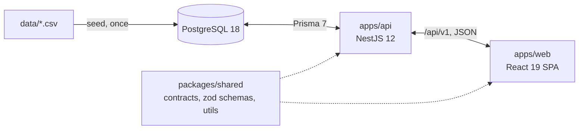

# Architecture

The target architecture. Each section notes the feature that implements it; [progress.md](progress.md) shows what exists today. The reasons behind the choices are in [decisions.md](decisions.md).

## Overview



- **`packages/shared`** (`@ars/shared`) — `contracts.ts` as delivered, zod schemas for API inputs and responses, and pure utilities (`today`, `addDays`, `eurosToCents`). Compiled to ESM in `dist/`. _Feature 1 (utilities), later features add schemas._
- **`apps/api`** — NestJS 12 (ESM) with Prisma 7 on PostgreSQL 18. _Features 2–8._
- **`apps/web`** — Vite 8, React 19, React Router 8, Tailwind 4, Redux Toolkit + RTK Query. _Features 9–13._
- **Docker Compose** — Postgres, the API (migrate → seed → start) and nginx serving the web build and proxying `/api`. _Features 2 (database) and 14 (full stack)._

## Data flow: CSV → database → API → UI

1. **Seed** (`npm run db:seed`, feature 4): `csv-parse` reads the CSV as snake_case strings; mappers convert and validate each row with zod; batched `createMany` inserts them. Tenants are assigned by country ([D-004](decisions.md#d-004-three-tenants-split-by-region)). The CSV is never read at runtime ([D-015](decisions.md#d-015-csv-is-loaded-once-by-a-typescript-seed)).
2. **Database** (feature 3): Prisma models with camelCase fields mapped to snake_case columns. Money is `Int` cents, calendar dates are `date`. CHECK and EXCLUDE constraints in the initial migration enforce the contract's value rules and non-overlapping active bookings; deleting a tenant cascades to its data ([D-036](decisions.md#d-036-the-database-enforces-the-contracts-value-rules)).
3. **API** (features 5–8): repositories load tenant-scoped rows; mappers turn them into `ListingDto` / `BookingDto` (`Date` → `IsoDate`, `Decimal` → `number | null`, no `tenantId`) ([D-016](decisions.md#d-016-contractsts-is-the-api-response-shape)).
4. **UI** (features 9–13): RTK Query fetches with arguments taken from the URL ([D-017](decisions.md#d-017-listing-filters-live-in-the-url)) and validates responses against the shared schemas in development.

## API structure

Each module follows controller → service → repository:

- **Controller** — routing, validation with shared zod schemas, permission declaration.
- **Service** — business rules; throws domain exceptions with a `code`.
- **Repository** — the only Prisma access; always receives `tenantId` for tenant data.

All routes are under `/api/v1` ([D-018](decisions.md#d-018-uri-versioning-under-apiv1)); tenant routes under `/api/v1/t/:tenantSlug/...`.

## API modules

One Nest module per area ([D-035](decisions.md#d-035-one-nest-module-per-area)). `AppModule` only imports modules, so it is the table of contents; each module file lists what its area provides.

```
apps/api/src/
  main.ts                 bootstrap: create the app, configureApp(), listen; fatal log + exit 1 on failure
  app.module.ts           imports the modules below
  app.setup.ts            prefix, versioning, CORS, logger, middleware that must run before the body parser
  api.constants.ts        `api` prefix and default version `1`
  core/
    config/               AppConfigModule — env file + zod validation, ConfigService (global)
    request-context/      RequestContextModule — request id, AsyncLocalStorage context
    logging/              LoggingModule — AppLoggerService, one line per request
    errors/               ErrorsModule — catch-all and Prisma filters (APP_FILTER), error body
    database/             DatabaseModule — PrismaService (the Prisma client)
  generated/prisma/       Prisma client (generated, gitignored)
  health/                 HealthModule — GET /api/health
```

| Module                 | Provides                                                                   | Imports                |
| ---------------------- | -------------------------------------------------------------------------- | ---------------------- |
| `AppConfigModule`      | `ConfigModule.forRoot` (global `ConfigService`)                            | —                      |
| `RequestContextModule` | `RequestContextService`, `RequestIdMiddleware`, `RequestContextMiddleware` | —                      |
| `LoggingModule`        | `AppLoggerService`, `RequestLoggerMiddleware`                              | `RequestContextModule` |
| `ErrorsModule`         | `AllExceptionsFilter`, `PrismaExceptionFilter` as `APP_FILTER`             | `RequestContextModule` |
| `DatabaseModule`       | `PrismaService` (exported)                                                 | —                      |
| `HealthModule`         | `HealthController`                                                         | —                      |

Features 5–8 add one module per entity — `users`, `tenants`, `listings`, `bookings`, `blocked-days` — plus `auth`, each in `src/<entities>/`, generated with the Nest CLI by the feature that gives it its first provider. Modules with a Prisma repository import `DatabaseModule`. An entity served to several audiences has one controller per audience in its module (e.g. `listings.controller.ts` for the portal, `host-listings.controller.ts` for the host panel). Repositories are an interface plus an injection token, implemented with Prisma.

**Public portal** (feature 6), all `@Public()`; the tenant routes go through `TenantGuard` ([D-044](decisions.md#d-044-a-portal-shows-only-its-own-tenants-listings)):

| Route (under `/api/v1`)                        | Module / controller                | Response                                                                                                                                  |
| ---------------------------------------------- | ---------------------------------- | ----------------------------------------------------------------------------------------------------------------------------------------- |
| `GET /tenants`                                 | `tenants/` · `TenantsController`   | `PublicTenant[]`, by slug                                                                                                                 |
| `GET /t/:tenantSlug`                           | `tenants/` · `TenantsController`   | `PublicTenant`, from the record `TenantGuard` loaded ([D-047](decisions.md#d-047-the-portals-configuration-comes-with-the-tenant-lookup)) |
| `GET /t/:tenantSlug/cities`                    | `listings/` · `ListingsController` | `string[]`, alphabetical                                                                                                                  |
| `GET /t/:tenantSlug/listings`                  | `listings/` · `ListingsController` | `Page<ListingDto>` ([D-045](decisions.md#d-045-listing-pages-24-by-default-at-most-48-ties-broken-by-id))                                 |
| `GET /t/:tenantSlug/listings/:id`              | `listings/` · `ListingsController` | `ListingDto`; 404 `LISTING_NOT_FOUND`                                                                                                     |
| `GET /t/:tenantSlug/listings/:id/availability` | `listings/` · `ListingsController` | `{ from, to, unavailableDays }` ([D-046](decisions.md#d-046-public-availability-lists-the-taken-days-of-a-range))                         |

Inputs are validated by `listingQuerySchema`, `availabilityQuerySchema` and `listingIdSchema` from `@ars/shared`; the web app uses the same schemas.

**Host panel** (feature 7), signed-in only; every controller runs `@UseGuards(TenantGuard, PermissionsGuard)`, so a host of the tenant and the superadmin get in, a client or another tenant's host gets 403 ([D-005](decisions.md#d-005-a-host-manages-all-listings-of-their-tenant)):

| Route (under `/api/v1`)                                     | Permission          | Module / controller                       | Response                                                                                                                                                                              |
| ----------------------------------------------------------- | ------------------- | ----------------------------------------- | ------------------------------------------------------------------------------------------------------------------------------------------------------------------------------------- |
| `GET /t/:tenantSlug/host/listings?q`                        | `listing:read`      | `listings/` · `HostListingsController`    | `Page<ListingDto>`, newest first ([D-050](decisions.md#d-050-the-host-listing-search-matches-the-title-or-the-city))                                                                  |
| `GET /t/:tenantSlug/host/listings/:id`                      | `listing:read`      | `listings/` · `HostListingsController`    | `ListingDto`; 404 `LISTING_NOT_FOUND`                                                                                                                                                 |
| `PATCH /t/:tenantSlug/host/listings/:id`                    | `listing:update`    | `listings/` · `HostListingsController`    | `ListingDto`; 409 `MAX_GUESTS_BELOW_BOOKING` ([D-014](decisions.md#d-014-listing-edits-cannot-break-booking-invariants))                                                              |
| `GET /t/:tenantSlug/host/listings/:id/blocked-days`         | `blocked-day:read`  | `blocked-days/` · `BlockedDaysController` | `{ from, to, days }`; past ranges allowed                                                                                                                                             |
| `POST /t/:tenantSlug/host/listings/:id/blocked-days`        | `blocked-day:write` | `blocked-days/` · `BlockedDaysController` | 201 `{ from, to, days }`; 409 `DAY_ALREADY_BOOKED` ([D-010](decisions.md#d-010-blocked-days-one-row-per-day), [D-049](decisions.md#d-049-a-blocking-request-covers-at-most-366-days)) |
| `DELETE /t/:tenantSlug/host/listings/:id/blocked-days`      | `blocked-day:write` | `blocked-days/` · `BlockedDaysController` | 204                                                                                                                                                                                   |
| `GET /t/:tenantSlug/host/bookings?listingId&status&from&to` | `booking:read`      | `bookings/` · `BookingsController`        | `Page<HostBooking>` by check-in ([D-048](decisions.md#d-048-host-bookings-carry-the-listings-title-and-a-total-at-its-current-price))                                                 |

`BlockedDaysService` asks the exported `ListingsService` whether the listing exists in the tenant and which days its active bookings take; `BlockedDaysRepository` touches only blocked-day rows. Inputs are validated by `hostListingQuerySchema`, `listingUpdateSchema`, `dateRangeSchema`, `blockDaysSchema`, `upcomingDateRangeSchema` and `hostBookingQuerySchema`.

## Request pipeline (API)

```mermaid
flowchart LR
  R[Request] --> RID[RequestId middleware<br/>x-request-id]
  RID --> LOG[RequestLogger middleware<br/>one line per request]
  LOG --> BP[CORS, body parser]
  BP --> CTX[RequestContext middleware<br/>AsyncLocalStorage]
  CTX --> AG[AuthGuard<br/>who you are]
  AG --> TG[TenantGuard<br/>slug → tenant, 404]
  TG --> PG[PermissionsGuard<br/>what you may do]
  PG --> V[zod validation]
  V --> H[Handler → service → repository]
  H -. exception .-> F[Exception filters<br/>apiErrorSchema]
```



- **Authentication** (feature 5): a global `AuthGuard` verifies the JWT (`sub`, `email`); `@Public()` opts a route out.
- **Tenant resolution** (feature 5): `TenantGuard` resolves `:tenantSlug` and exposes the tenant with `@CurrentTenant()`.
- **Authorization** (feature 5): `PermissionsGuard` checks `@RequirePermissions(...)` against the role computed for the URL's tenant — superadmin, host (membership) or client — through `ROLE_PERMISSIONS` ([D-007](decisions.md#d-007-roles-are-not-in-the-token)).
- **Errors** (features 2–3): a catch-all filter and a Prisma filter return the `apiErrorSchema` shape; 5xx never include a stack trace ([D-019](decisions.md#d-019-one-error-format-for-the-whole-api)).
- **Logging** (feature 2): request id in every log line, the response header and the error body; one log line per request ([D-020](decisions.md#d-020-logging-with-the-built-in-consolelogger), [D-034](decisions.md#d-034-request-id-through-a-response-header-and-asynclocalstorage)). `RequestId` and `RequestLogger` are registered with `app.use` so they run before CORS and the body parser; the request context is entered after the body parser, because an `AsyncLocalStorage` context does not survive its stream callbacks.

## Tenant isolation

Enforced in the application layer ([D-006](decisions.md#d-006-tenant-isolation-in-the-application-layer)):

- the tenant comes only from the URL slug, resolved by `TenantGuard`;
- every repository method for listings, bookings and blocked days takes `tenantId`; single rows are loaded by `id` **and** `tenantId`;
- e2e tests prove that another tenant's data returns 404 and another tenant's host routes return 403.

## Availability

Derived at read time from bookings and blocked days ([D-009](decisions.md#d-009-availability-is-derived-at-read-time), [D-010](decisions.md#d-010-blocked-days-one-row-per-day)):

- stays are half-open `[checkIn, checkOut)`; the checkout day is free;
- cancelled bookings block nothing;
- a listing is free for `[from, to)` when no active booking overlaps and no day in the range is blocked.

In the API (feature 6) one pair of Prisma predicates, `activeStaysOverlapping` and `blockedDaysWithin` (`listings/build-listing-query.ts`), serves both the list's date filter (inside `none`) and the listing's calendar (as relation selects). The pure `unavailableDays` turns the stays and blocked days it loads into the taken days of the range.

The host panel (feature 7) reuses them: blocking checks the range with the same active-stay predicate (a booked day is a 409, a day under a cancelled booking may be blocked), unblocking and the blocked-day list use `blockedDaysWithin`, and the host booking filter uses `staysOverlapping` — the same overlap without the status.

## Web structure

- `app/` — store (`baseApi` + `authSlice` + `uiSlice`), router, providers.
- `shared/api/` — one `createApi`; features inject their endpoints; `getErrorMessage` narrows errors.
- `shared/ui/` — the UI kit (variant maps, design tokens only, mobile-first).
- `shared/config/env.ts` — the only module that reads `import.meta.env`, validated with zod.
- `features/listings`, `features/auth`, `features/host`, `features/admin` — pages and feature components.
- Layouts: `PortalLayout` (tenant branding), `HostLayout`, `AdminLayout`.
- Errors: a root route boundary, layout boundaries and a widget boundary class; `QueryState` for loading / error / empty states.

## Configuration

Every environment-specific value comes from `.env`, validated at startup in one module per app ([D-022](decisions.md#d-022-configuration-comes-only-from-validated-env)). `.env.example` files are added by the features that introduce the variables ([D-027](decisions.md#d-027-envexample-files-are-created-with-the-feature-that-needs-them)).

- **API:** `ConfigModule` validates the env with the zod schema in `apps/api/src/core/config/env.schema.ts` and serves the parsed values through `ConfigService`. It loads `apps/api/.env`, or `apps/api/.env.test` when `NODE_ENV=test` (both Vitest configs set it); real environment variables win over the file. In test mode `DATABASE_URL` must name a database ending in `_test`. The Prisma CLI reads the same `apps/api/.env` through `prisma.config.ts` ([D-037](decisions.md#d-037-generating-the-prisma-client-needs-no-database)); at startup the API waits for the database ([D-038](decisions.md#d-038-the-api-waits-for-the-database-at-startup)). An invalid or missing variable stops the start: the error names every failing variable, is logged as `fatal`, and the process exits with code 1.
- **Docker Compose:** the root `.env` (from the root `.env.example`) holds the Postgres credentials, the test database name and the host port.
