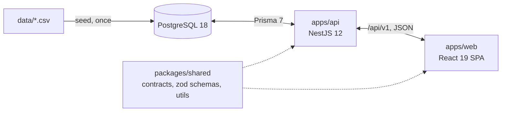
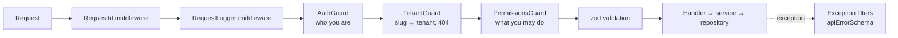

# Architecture

The target architecture. Each section notes the feature that implements it; [progress.md](progress.md) shows what exists today. The reasons behind the choices are in [decisions.md](decisions.md).

## Overview

- **`packages/shared`** (`@ars/shared`) — `contracts.ts` as delivered, zod schemas for API inputs and responses, and pure utilities (`today`, `addDays`, `eurosToCents`). Compiled to ESM in `dist/`. _Feature 1 (utilities), later features add schemas._
- **`apps/api`** — NestJS 12 (ESM) with Prisma 7 on PostgreSQL 18. _Features 2–8._
- **`apps/web`** — Vite 8, React 19, React Router 8, Tailwind 4, Redux Toolkit + RTK Query. _Features 9–13._
- **Docker Compose** — Postgres, the API (migrate → seed → start) and nginx serving the web build and proxying `/api`. _Features 2 (database) and 14 (full stack)._

## Data flow: CSV → database → API → UI

1. **Seed** (`npm run db:seed`, feature 4): `csv-parse` reads the CSV as snake_case strings; mappers convert and validate each row with zod; batched `createMany` inserts them. Tenants are assigned by country ([D-004](decisions.md#d-004-three-tenants-split-by-region)). The CSV is never read at runtime ([D-015](decisions.md#d-015-csv-is-loaded-once-by-a-typescript-seed)).
2. **Database** (feature 3): Prisma models with camelCase fields mapped to snake_case columns. Money is `Int` cents, calendar dates are `date`.
3. **API** (features 5–8): repositories load tenant-scoped rows; mappers turn them into `ListingDto` / `BookingDto` (`Date` → `IsoDate`, `Decimal` → `number | null`, no `tenantId`) ([D-016](decisions.md#d-016-contractsts-is-the-api-response-shape)).
4. **UI** (features 9–13): RTK Query fetches with arguments taken from the URL ([D-017](decisions.md#d-017-listing-filters-live-in-the-url)) and validates responses against the shared schemas in development.

## API structure

Each module follows controller → service → repository:

- **Controller** — routing, validation with shared zod schemas, permission declaration.
- **Service** — business rules; throws domain exceptions with a `code`.
- **Repository** — the only Prisma access; always receives `tenantId` for tenant data.

All routes are under `/api/v1` ([D-018](decisions.md#d-018-uri-versioning-under-apiv1)); tenant routes under `/api/v1/t/:tenantSlug/...`.

## Request pipeline (API)

- **Authentication** (feature 5): a global `AuthGuard` verifies the JWT (`sub`, `email`); `@Public()` opts a route out.
- **Tenant resolution** (feature 5): `TenantGuard` resolves `:tenantSlug` and exposes the tenant with `@CurrentTenant()`.
- **Authorization** (feature 5): `PermissionsGuard` checks `@RequirePermissions(...)` against the role computed for the URL's tenant — superadmin, host (membership) or client — through `ROLE_PERMISSIONS` ([D-007](decisions.md#d-007-roles-are-not-in-the-token)).
- **Errors** (features 2–3): a catch-all filter and a Prisma filter return the `apiErrorSchema` shape; 5xx never include a stack trace ([D-019](decisions.md#d-019-one-error-format-for-the-whole-api)).
- **Logging** (feature 2): request id in every log line, the response header and the error body; one log line per request ([D-020](decisions.md#d-020-logging-with-the-built-in-consolelogger)).

## Tenant isolation

Enforced in the application layer ([D-006](decisions.md#d-006-tenant-isolation-in-the-application-layer)):

- the tenant comes only from the URL slug, resolved by `TenantGuard`;
- every repository method for listings, bookings and blocked days takes `tenantId`; single rows are loaded by `id` **and** `tenantId`;
- e2e tests prove that another tenant's data returns 404 and another tenant's host routes return 403.

## Availability

Derived at read time from bookings and blocked days ([D-009](decisions.md#d-009-availability-is-derived-at-read-time), [D-010](decisions.md#d-010-blocked-days-one-row-per-day)):

- stays are half-open `[checkIn, checkOut)`; the checkout day is free;
- cancelled bookings block nothing;
- a listing is free for `[from, to)` when no active booking overlaps and no day in the range is blocked.

## Web structure

- `app/` — store (`baseApi` + `authSlice` + `uiSlice`), router, providers.
- `shared/api/` — one `createApi`; features inject their endpoints; `getErrorMessage` narrows errors.
- `shared/ui/` — the UI kit (variant maps, design tokens only, mobile-first).
- `shared/config/env.ts` — the only module that reads `import.meta.env`, validated with zod.
- `features/listings`, `features/auth`, `features/host`, `features/admin` — pages and feature components.
- Layouts: `PortalLayout` (tenant branding), `HostLayout`, `AdminLayout`.
- Errors: a root route boundary, layout boundaries and a widget boundary class; `QueryState` for loading / error / empty states.

## Configuration

Every environment-specific value comes from `.env`, validated at startup in one module per app ([D-022](decisions.md#d-022-configuration-comes-only-from-validated-env)). `.env.example` files are added by the features that introduce the variables ([D-027](decisions.md#d-027-envexample-files-are-created-with-the-feature-that-needs-them)).
